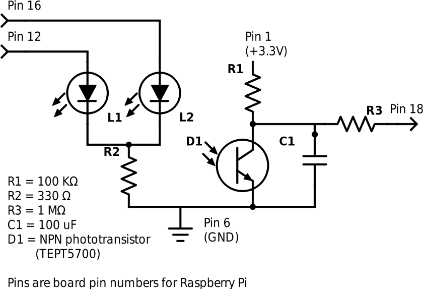

Home electrical power monitoring
********************************

Construction
============

Using the :ref:`ref-tept5700` biased by a 180KΩ resistor we detect
the metrology LED flash.

Voltage at collector is our input and is low when light present. The pull-up
resistor keeps the input stable. EMI cannot drop the voltage, so does not
generate spurious signals (as would be the case if R1 and D1 were swapped), but
it can overload the Pi input in extreme cases. The 1MΩ resistor R3 is intended
to limit current to the GPIO pin. It is sized as the largest to hand when the
author built this, but could probably be an order of magnitude larger.

L1 and L2 are purely for the application to provide indication to the user.
One, for example, will flash each time the metrology LED flash is detected.

(diagram created with https://www.digikey.com/schemeit)
