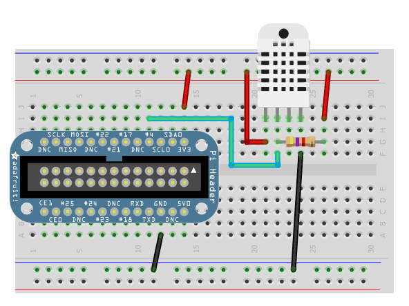

.. _ref-dht22:

DHT22/AM2302 Relative Humidity sensor
*************************************

(PDF) technical spec
====================

[INSERT]

Interface: Bespoke (not SPI, I2C, 1-wire or anything else!)

Packaged boards
===============

[LINKS TO UNIT]

Tutorials
=========

[INSERT]

Wiring to Pi
============

(image credit:
https://learn.adafruit.com/dht-humidity-sensing-on-raspberry-pi-with-gdocs-logging/overview)

Note that this must be connected to the 3.3V rail. The input (from 2nd pin from
left on the DHT22) can go to any GPIO input that is convenient.

The resistor is 4.7kΩ.

Installing Adafruit Python library
==================================

Github: git@github.com:adafruit/Adafruit_Python_DHT.git

Check out and run `setup.py install`. You will need dependencies listed
in the Raspberry Pi notes.

.. note:: The library call uses Broadcom pin labeling and not GPIO pin numbers.
