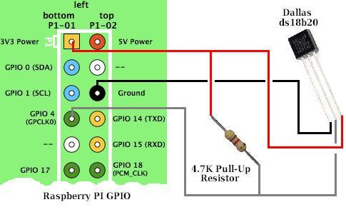

.. _ref-ds18b20:

Dallas DS18B20 digital temperature sensor
*****************************************

(PDF) technical spec
====================

Datasheet: https://datasheets.maximintegrated.com/en/ds/DS18B20.pdf

Interface: Dallas 1-wire

Packaged boards
===============

[LINKS TO UNIT]

Tutorials
=========

[INSERT]

Wiring to Pi
============

* http://www.reuk.co.uk/wordpress/raspberry-pi/ds18b20-temperature-sensor-with-raspberry-pi/
* http://www.dreamgreenhouse.com/features/rpi/1wire/index.php

Interfacing with the device
===========================

(image credit:
http://www.reuk.co.uk/wordpress/raspberry-pi/ds18b20-temperature-sensor-with-raspberry-pi/)

Wire up the device as above and enable 1-wire as per the Raspberry Pi notes.

To explore from the command line:

List the number of device on the 1-Wire bus:

.. code-block:: bash

    $ cat /sys/bus/w1/devices/w1_bus_master1/w1_master_slave_count

List the devices and IDs on the 1-Wire bus:

.. code-block:: bash

    $ cat /sys/bus/w1/devices/w1_bus_master1/w1_master_slaves

Shows deivce IDs, such as:

.. code-block:: bash

    28-0314679a5fff
    28-031467d30cff

The Dallas devices should be prefixed 28. We have two units on the bus.

To test the sensor is working, we read the sensor file using an ID
discovered above:

.. code-block:: bash

    $ cat /sys/bus/w1/devices/28-031467d30cff/w1_slave

    7b 01 55 00 7f ff 0c 10 92 : crc=92 YES
    7b 01 55 00 7f ff 0c 10 92 t=23687

The number after the t= is the temperature in milli-degree Celcius, so in the
above example that is 23.687 degrees Celcius.
